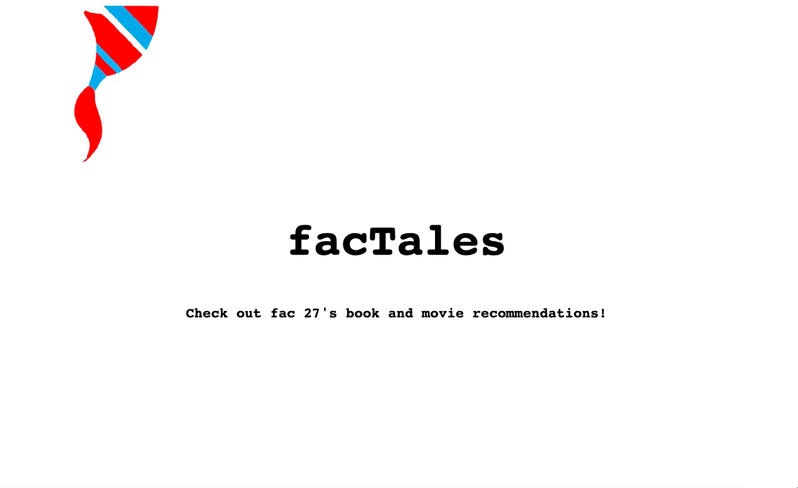

# FACTales

FacTales allows users to submit movie and book recommendations and view all existing recommendations from other users. Movie recommendations are stored in a SQLite database.

## Collaborating

**Clone the Repo**
```
git clone https://github.com/fac27/FACTales/
```
**Install all dependencies**
```
npm install
```
**Seed your database with test data**
```
npm run seed
```

**Start the server**
```
npm run dev
```

**Running tests**
```
npm run test
```

## User Stories

As a user...

[x] I want to select my name from a drop down list to submit a recommendation

[x] I want to submit a movie recommendation

[x] I want to submit a book recommendation

[x] I want to view the recommendations of others

[x] I want to filter other recommendations grouped by movie or book

[x] I want to use the app on all my devices

### Stretch Stories

[ ] As a user I want to be able to delete my previous recommendations

## Our wireframes


## Mobile first

Our app was created using a mobile first approach to maximise accesibility.

Web view:



Mobile view:


